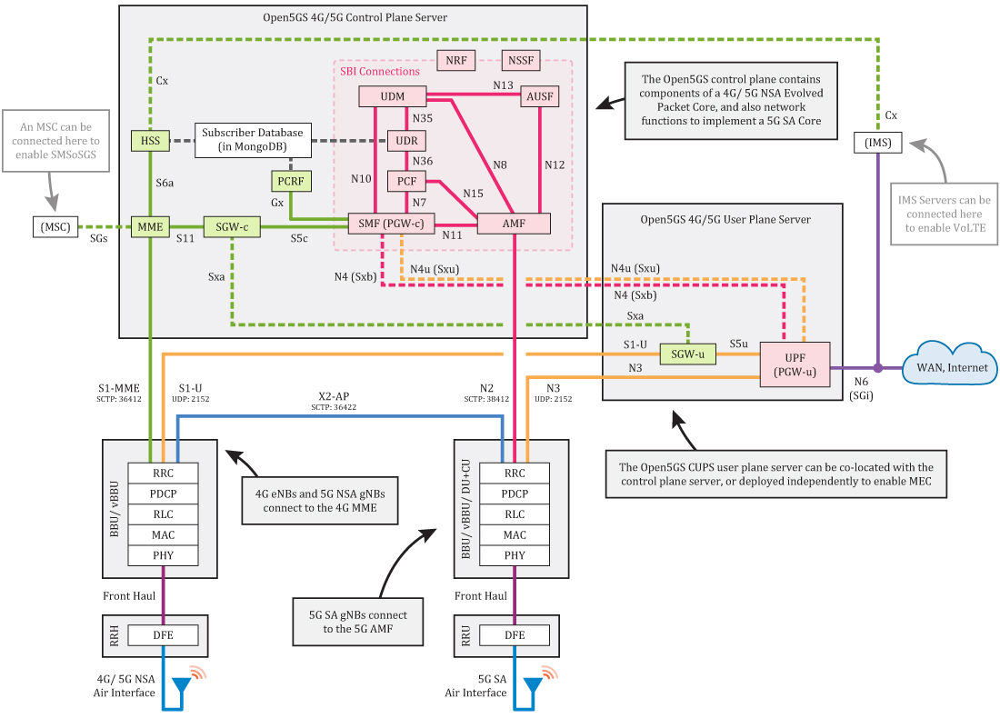

# dockerizing-4g

What about [open5gs](https://github.com/open5gs/open5gs) and [srsRAN](https://github.com/srsran/srsran_4g) in a docker?

## Usage

```sh
docker compose up --force-recreate --build

# rebuild without cache or just docker system prune -a
docker compose build --no-cache

# see log of service (ue)
docker compose logs ue -f
```

## Explanation

At start, I wanted to just have a simple architecture with a UE, a eNB and a 4G core network with one docker for each part. But unfortunatly for us this could be possible because of Docker. In fact, docker doesn't use systemd, so it's not possible to run multiple services in one container (it's kinda logic because it's the central point of docker to have one service per container). So I also tried to use [podma](https://podman.io/) and [podman compose](https://github.com/containers/podman-compose) (podman could potentially solve the issue with systemd because it hasn't the same logic as Docker and you should be able to run systemd in the container) but it didn't really worked out of the box so I moved to another solution: to create one core service per container.

For the realistics part, I also made different networks te separate the fronthaul (UE + eNB) to the backhaul (core network). For the sake of it I also added a "frontier" network that is shared between the core network and the eNB to simulate the S1 interface.

For the core network services, I also needed some 5G components to make it work. Because these components are used under the hood of the 4G core network:

- the SMF (Session Management Function) which acts as the PGW-c
- the UPF (User Plane Function) which acts as the PGW-u

At this times it's not fully working because of the issue with the diameter the connection between the PCRF and the SMF. This is quite problematic because we cannot identify the UE and the session is not created, so the full network is not working.

During the dockerization I also add some troubles with Docker with certain rights, for example the network namespace functionnalities are not available in the container. So I had to use the `privileged` flag to make it work. This is not a good practice but it's the only way to make it work for now. The same for the UPF which try to open `/dev/net/tun`.

Some cool feature of this dockerization is the binding of the logs: it's very easy to see the logs of the different services in there respective (binded) files. Also the webui of the core network is available at `http://localhost:9999`, made possible by the port binding. The same is possible for the MongoDB database: as we bind the port 27017 of the container to the host, we can access the database with a MongoDB client.

The current architecture is the following:


<details>

<summary>The schema from Open5GS is also great</summary>



</details>

Here is a little video of the current state of the project:

[https://www.youtube.com/watch?v=sfBN9uoLuZ8](https://www.youtube.com/watch?v=sfBN9uoLuZ8)
